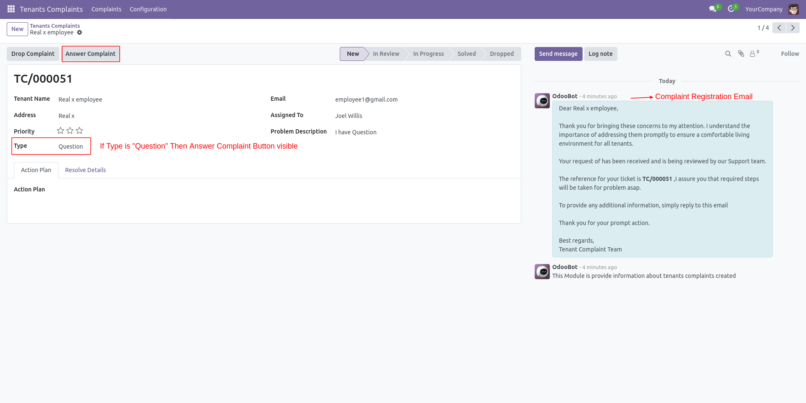

RealEstate Tenant Register Complaint (Website)
--------------------------

**1. Tenant Complaint Register View.**

* **Tenant Name :-** Name Of Tenant.
* **Email :-** Registered Tenant Email Enter valid email for smoother communication.
* **Address :-** Tenant (aprtment, flat, ...) Address.
* **Type :-** Complaint Type (Ex. Heating issue, Water, Question ..etc)
* **Description :-** Describe the problem in detail, If **Question** then describe question.

By Clicking Submit button complaint will be submited.
-

**2. Thank You Page.**

- Once Complaint is registered displays thank you page and **complaint number**.

RealEstate Tenant Register Complaint (Backend)
-

**1. Admin Panel Complaint View.**

* If complaint registered tenant get **complaint email** and with **complaint number** on email.
* if type is **Question**, **Answer Complaint** button visible.
* Admin Directly drop complaint by **DropComplaint** button.

**2. Answer Complaint View.**

* Give answer to complaint and directly close complaint.

**3. Solved Answer Complaint View.**

* Once complaint closed with answer it wil **send mail to tenant with answer** and representative can see details **solved date** and **reason**.

**4. Complaint View (Type not question).**

* Complaint type is not **Question** so here **Classify Complaint** button visible.
* And representative note down **Action Plan** for the complaint.

**5. Complaint View (In Review State)**

* In this state, representative classify complaint with action plan using **Classify with action plan** button.
* representative need to write down **ActionPlan(Required)**.

**6. Complaint View (In Progress State)**

* Once Classify Complaint Done representative can **resolve** complaint.

**7. Complaint View (Resolved State)**

* Once representative **resolve** complaint a **mail send to tenant** with taken **actionplan** taken for solve complaint.
* in **Resolve Details** Section representative can see details of resolve reason and date.